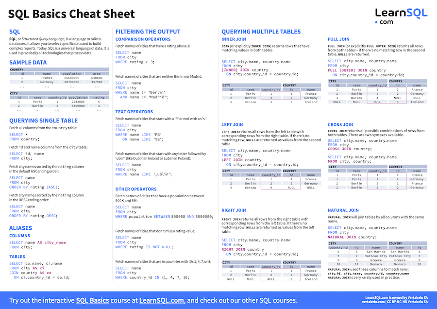
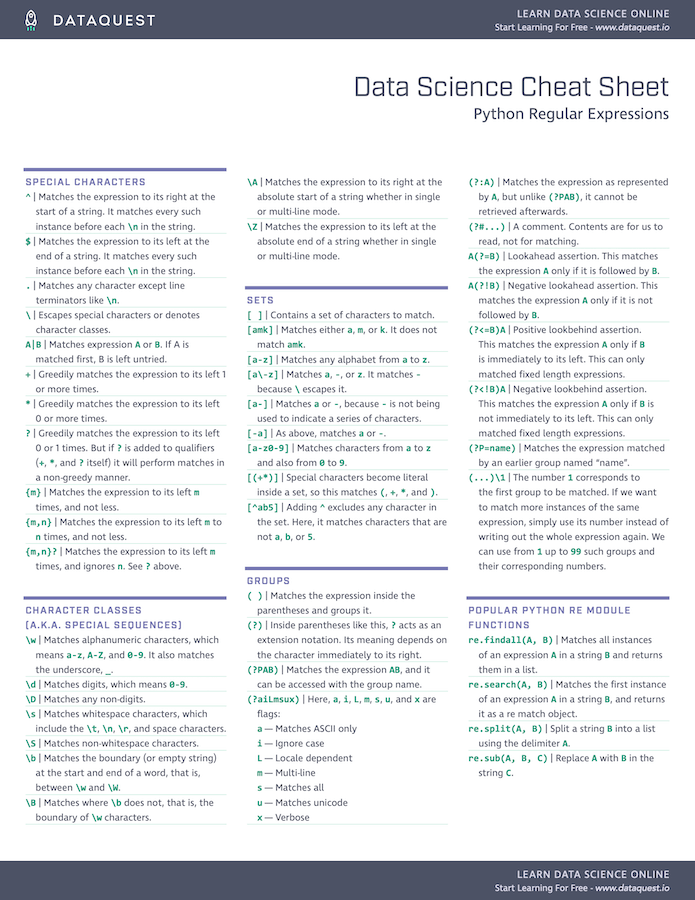
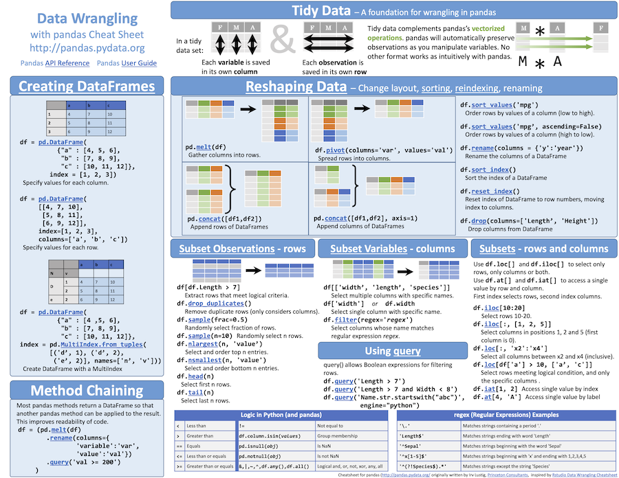
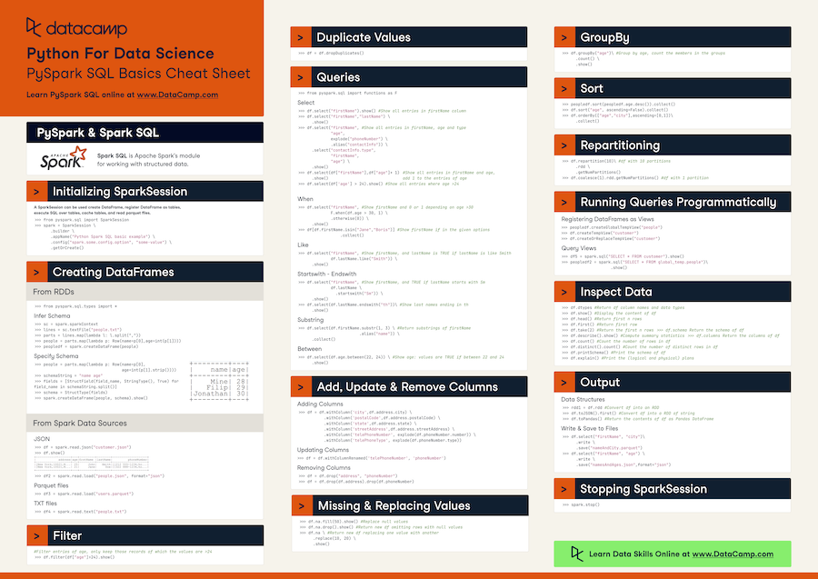
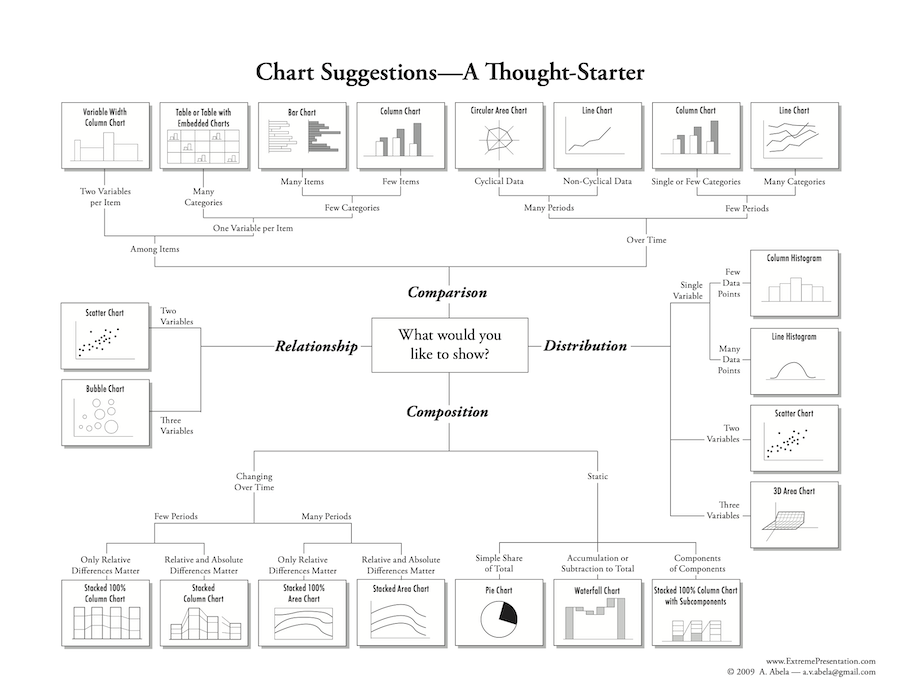
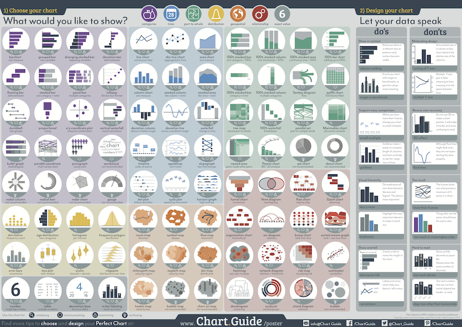
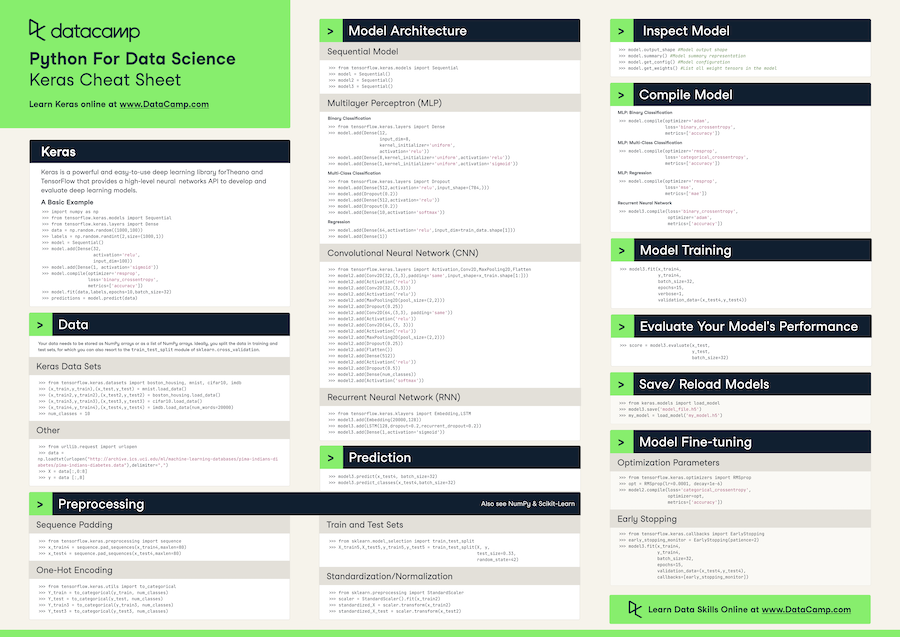
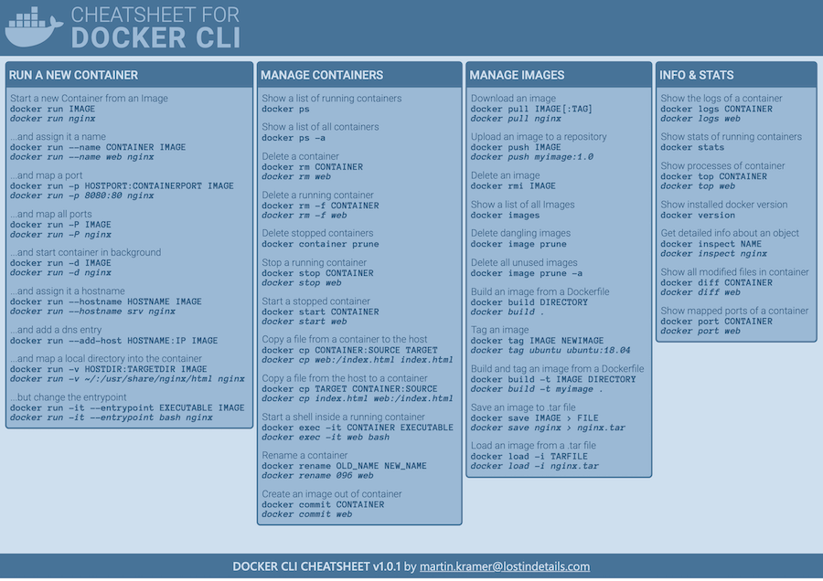

# Data Science cheat sheets

A collection of Data Science cheat sheets.

## Table of contents

- [Data Extraction](#data-extraction)
  - [SQL](#sql)
  - [Python Regular expressions](#python-regular-expressions)
- [Data Processing](#data-processing)
  - [Polars](#polars)
  - [Pandas](#pandas)
  - [PySpark](#pyspark)
- [Visualization](#visualization)
  - [Plotly Express](#plotly-express)
  - [Choosing a good chart](#choosing-a-good-chart)
  - [Chart guide](#chart-guide)
- [Modeling](#modeling)
  - [Keras](#keras)
- [Infrastructure](#infrastructure)
  - [Docker](#docker)

## Data Extraction

### SQL

Source: [https://learnsql.com/tags/cheat-sheet/](https://learnsql.com/tags/cheat-sheet/)

### [Python Regular expressions](https://docs.python.org/3/library/re.html)

Source: [https://www.dataquest.io/blog/regex-cheatsheet/](https://www.dataquest.io/blog/regex-cheatsheet/)

## Data Processing

### [Polars](https://www.pola.rs/)

Source: [FranzDiebold/polars-cheat-sheet](https://github.com/FranzDiebold/polars-cheat-sheet)

### [Pandas](https://pandas.pydata.org/)

Source: [https://pandas.pydata.org/Pandas_Cheat_Sheet.pdf](https://pandas.pydata.org/Pandas_Cheat_Sheet.pdf)

### [PySpark](https://spark.apache.org/docs/latest/api/python/)

Source: [https://www.datacamp.com/cheat-sheet/pyspark-cheat-sheet-spark-dataframes-in-python](https://www.datacamp.com/cheat-sheet/pyspark-cheat-sheet-spark-dataframes-in-python)

## Visualization

### [Plotly Express](https://plotly.com/python/plotly-express/)

Source: [FranzDiebold/plotly-express-cheat-sheet](https://github.com/FranzDiebold/plotly-express-cheat-sheet)

### Choosing a good chart

Source: [https://www.tapclicks.com/resources/blog/data-visualization-types/](https://www.tapclicks.com/resources/blog/data-visualization-types/)

### Chart guide

Source: [https://chart.guide/poster/](https://chart.guide/poster/)

## Modeling

### [Keras](https://keras.io/)

Source: [https://www.datacamp.com/cheat-sheet/keras-cheat-sheet-neural-networks-in-python](https://www.datacamp.com/cheat-sheet/keras-cheat-sheet-neural-networks-in-python)

## Infrastructure

### [Docker](https://www.docker.com/)

Sources:

- [https://www.lostindetails.com/cheatsheet/docker/docker_blue_light1.pdf](https://www.lostindetails.com/cheatsheet/docker/docker_blue_light1.pdf)
- [https://dockerlux.github.io/pdf/cheat-sheet-v2.pdf](https://dockerlux.github.io/pdf/cheat-sheet-v2.pdf)
