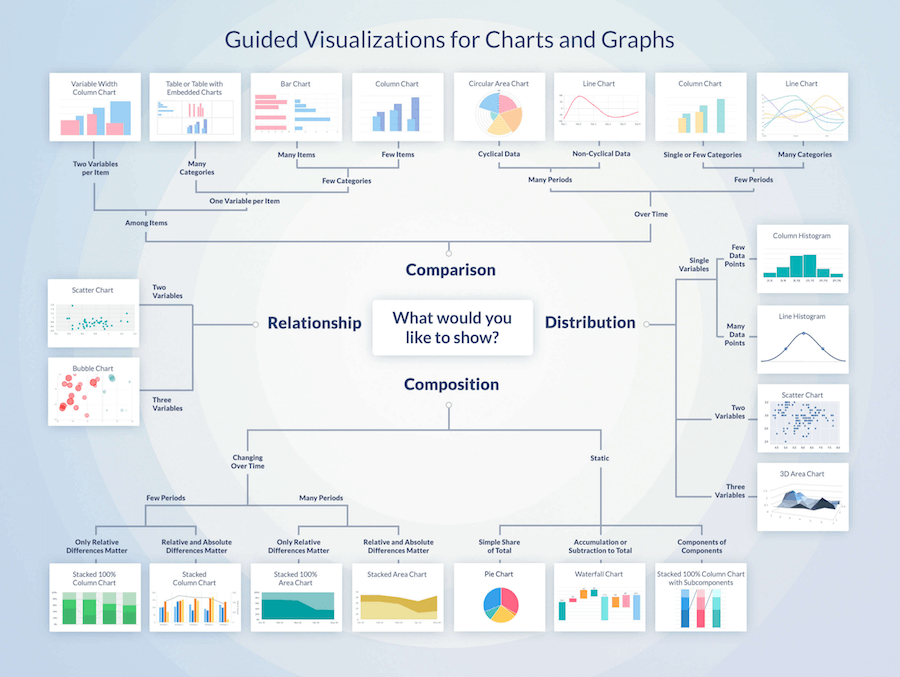

# Data Science cheatsheets

A collection of Data Science cheatsheets.

## Data Extraction

### SQL

Source: [https://learnsql.com/tags/cheat-sheet/](https://learnsql.com/tags/cheat-sheet/)

## Data Processing

### [Pandas](https://pandas.pydata.org/)

Source: [https://pandas.pydata.org/Pandas_Cheat_Sheet.pdf](https://pandas.pydata.org/Pandas_Cheat_Sheet.pdf)

### [PySpark](https://spark.apache.org/docs/latest/api/python/)

Source: [https://www.datacamp.com/cheat-sheet/pyspark-cheat-sheet-spark-dataframes-in-python](https://www.datacamp.com/cheat-sheet/pyspark-cheat-sheet-spark-dataframes-in-python)

## Visualization

### Choosing a good chart

Source: [https://extremepresentation.typepad.com/files/choosing-a-good-chart-09.pdf](https://extremepresentation.typepad.com/files/choosing-a-good-chart-09.pdf)

### Chart guide

Source: [https://chart.guide/poster/](https://chart.guide/poster/)
